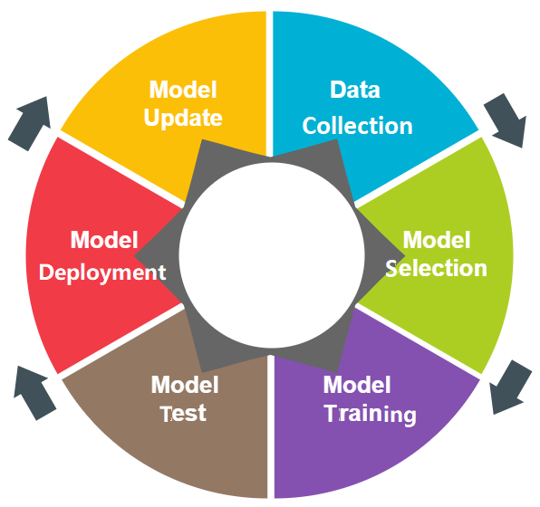

- [Bi-LSTM for anomaly detection](#bi-lstm-for-anomaly-detection)
  * [0. System Requirement](#0-system-requirement)
  * [1. Data Preparation](#1-data-preparation)
    + [1.1 UNSW-NB15](#11-unsw-nb15)
    + [1.2 SOSP 2009](#12-sosp-2009)
  * [2. Execution Examples](#2-execution-examples)
    + [2.1 UNSW-NB15](#21-unsw-nb15)
    + [2.2 SOSP 2009](#22-sosp-2009)
  * [MISC](#misc)

# Bi-LSTM for anomaly detection
In this work, we utilize the logic `Data preparation --> Model training/testing --> Model deployment/update` as shown in the following figure to organize this project for our Book "AI for CyberSecurity". Sorry about that we do not implement deployment of models here which depends on your own scenario and hardware requirements.

</img>

## 0. System Requirement
This project was developed on ***BIZON G3000 – 2-4 GPU Deep Learning Workstation PC*** (spec listed below).  This project requires ***64 GB memory***, or it will crash during runtime.  It took *1-2 hours* to run a single executation (i.e., *exp-unswnb15.py* and *exp-sosp2009.py*).  A single execution includes training, testing, and generating evaluation metrics, but not preprocessing and plotting.

| Spec          | Description                                                  |
| ------------- | ------------------------------------------------------------ |
| Processor     | Skylake X; 8-Core 3.80 GHz Intel Core i7-9800X               |
| Memory        | DDR4 3000MHz 64 GB (4 x 16 GB)                               |
| Graphics Card | 2 x NVIDIA RTX 2080 8 GB with 1 x NVLink Bridge              |
| System        | Ubuntu 18.04 Bionic (not using Bizon's preinstalled package) |
| Environment   | Python3 3.7.4, Tensorflow 2.3.0        |

Environment requirements are also written in `requirement.txt`, you can conveniently build it via `pip install -r requirement.txt`.

In codes for chapter 4, module "spacy" is used with spacy.load('en_core_web_md') in models/dablog.py. An additional step between model installation and code execution is needed: `python3 -m spacy download en_core_web_md`.

## 1. Data Preparation
The **datasets** folder provides a few preprocessed data examples.  For full datasets, please find them from the links below.

| Name      | Content | Link |
| --------- | ------- | ---- |
| UNSW-NB15 | Network Traffic Capture | [https://research.unsw.edu.au/projects/unsw-nb15-dataset](https://research.unsw.edu.au/projects/unsw-nb15-dataset) |
| SOSP 2009 | Hadoop File System Log  | [http://people.iiis.tsinghua.edu.cn/~weixu/sospdata.html](http://people.iiis.tsinghua.edu.cn/~weixu/sospdata.html) |

### 1.1 UNSW-NB15
For UNSW-NB15, the **data/unswnb15** folder provides two scripts. Please run the following command to preprocess UNSW-NB15. Also, we provide a shell script `download.sh` and `process.sh` in `data/unswnb15/` directory to download and process datasets.

The `key.py` introduces Key statistical results for UNSW-NB15 dataset. The command example is like this:
```shell
python3 data/unswnb15/key.py datasets/unsw-nb15/149.171.126.1/flows.csv
python3 data/unswnb15/key.py datasets/unsw-nb15/149.171.126.1/flow_from_this.csv
python3 data/unswnb15/key.py datasets/unsw-nb15/149.171.126.1/flow_to_this.csv

python3 data/unswnb15/key.py datasets/unsw-nb15/149.171.126.1/flows.csv --nodi
```

### 1.2 SOSP 2009
For *SOSP 2009*, `download_process.sh` will download the dataset and put it in `dataset/sosp2009/`. We just simply split the dataset based on block ID (no script provided, we will introduce it in `exp-sosp2009.py`).

## 2. Execution Examples
### 2.1 UNSW-NB15
Please use flags if needed.  For example, to specify input directory, use `-i datasets/unsw-nb15/`. Please use `-h` for flag options.

```shell
usage: exp-unswnb15.py [-h] [-i INPUT] [-o OUTPUT] [-m MODEL] [--train-file TRAIN_FILE] [--test-file TEST_FILE] [--seqlen SEQLEN] [--epochs EPOCHS]
                       [--logkeys LOGKEYS] [--use-gpu USE_GPU [USE_GPU ...]] [--use-mimick] [--stats-step STATS_STEP] [--window-size WINDOW_SIZE]
                       [--key-divisor KEY_DIVISOR] [--label-size LABEL_SIZE] [--check-sequences CHECK_SEQUENCES]
```

```shell
python3 exp-unswnb15.py ad -i datasets/unsw-nb15/ -o out/unsw-nb15/2020-10-21_dablog_k706_ip1hr -m dablog --window-size 60 --key-divisor 100
python3 exp-unswnb15.py ad -i datasets/unsw-nb15/ -o out/unsw-nb15/2020-10-21_dablog_k706_iphhr -m dablog --window-size 30 --key-divisor 100
python3 exp-unswnb15.py ad -i datasets/unsw-nb15/ -o out/unsw-nb15/2020-10-21_dablog_k706_ipqhr -m dablog --window-size 15 --key-divisor 100
python3 exp-unswnb15.py ad -i datasets/unsw-nb15/ -o out/unsw-nb15/2020-10-21_dablog_k366_ip1hr -m dablog --window-size 60 --key-divisor 1000
python3 exp-unswnb15.py ad -i datasets/unsw-nb15/ -o out/unsw-nb15/2020-10-21_dablog_k366_iphhr -m dablog --window-size 30 --key-divisor 1000
python3 exp-unswnb15.py ad -i datasets/unsw-nb15/ -o out/unsw-nb15/2020-10-21_dablog_k366_ipqhr -m dablog --window-size 15 --key-divisor 1000
```

### 2.2 SOSP 2009
Please use flags if needed.  For example, to specify input directory, use `-i datasets/sosp2009/`.  Please use `-h` for flag options.

```shell
usage: exp-unswnb15.py [-h] [-i INPUT] [-o OUTPUT] [-m MODEL] [--train-file TRAIN_FILE] [--test-file TEST_FILE] [--seqlen SEQLEN] [--epochs EPOCHS]
                       [--logkeys LOGKEYS] [--use-gpu USE_GPU [USE_GPU ...]] [--use-mimick] [--stats-step STATS_STEP] [--window-size WINDOW_SIZE]
                       [--key-divisor KEY_DIVISOR] [--label-size LABEL_SIZE] [--check-sequences CHECK_SEQUENCES]
                       operation
```

```shell
python3 exp-sosp2009.py detect -i datasets/sosp2009/ -o out/sosp2009/2020-02-27_1 -l datasets/sosp2009/anomaly_label.csv --test-normal 200000 -m dablog
python3 exp-sosp2009.py detect -i datasets/sosp2009/ -o out/sosp2009/2020-02-27_3 -l datasets/sosp2009/anomaly_label.csv --test-normal 200000  -m sdae
python3 exp-sosp2009.py detect -i datasets/sosp2009/ -o out/sosp2009/2020-02-27_5 -l datasets/sosp2009/anomaly_label.csv --test-normal 200000  -m dablog
python3 exp-sosp2009.py detect -i datasets/sosp2009/ -o out/sosp2009/2020-02-27_7 -l datasets/sosp2009/anomaly_label.csv --test-normal 200000  -m sdae
python3 exp-sosp2009.py detect -i datasets/sosp2009/ -o out/sosp2009/2020-02-27_9 -l datasets/sosp2009/anomaly_label.csv --test-normal 200000  -m dablog
python3 exp-sosp2009.py detect -i datasets/sosp2009/ -o out/sosp2009/2020-02-27_11 -l datasets/sosp2009/anomaly_label.csv --test-normal 200000  -m sdae
python3 exp-sosp2009.py detect -i datasets/sosp2009/ -o out/sosp2009/2020-02-27_13 -l datasets/sosp2009/anomaly_label.csv --test-normal 200000  -m dablog
python3 exp-sosp2009.py detect -i datasets/sosp2009/ -o out/sosp2009/2020-02-27_15 -l datasets/sosp2009/anomaly_label.csv --test-normal 200000  -m sdae
python3 exp-sosp2009.py detect -i datasets/sosp2009/ -o out/sosp2009/2020-02-27_19 -l datasets/sosp2009/anomaly_label.csv --test-normal 200000  -m sdae

python3 exp-sosp2009.py detect -i datasets/sosp2009/ -o out/sosp2009/2020-02-28_1 -l datasets/sosp2009/anomaly_label.csv --use-gpu 0 --logkeys 2 --train-normal 5000 --epochs 64 --test-normal 200000  -m dablog
python3 exp-sosp2009.py detect -i datasets/sosp2009/ -o out/sosp2009/2020-02-29_1 -l dataset/sosp2009/anomaly_label.csv --use-gpu 0 --logkeys 3 --train-normal 5000 --epochs 256 --test-normal 100000  -m dablog
python3 exp-sosp2009.py detect -i datasets/sosp2009/ -o out/sosp2009/2020-02-29_2 -l datasets/sosp2009/anomaly_label.csv --use-gpu 0 --logkeys 3 --train-normal 100000 --test-normal 100000  -m dablog
python3 exp-sosp2009.py detect -i datasets/sosp2009/ -o out/sosp2009/2020-02-29_9 -l datasets/sosp2009/anomaly_label.csv --use-gpu 0 --logkeys 3 --train-normal 100000 --test-normal 100000  -m sdae
python3 exp-sosp2009.py detect -i datasets/sosp2009/ -o out/sosp2009/2020-04-15_1 -l datasets/sosp2009/anomaly_label.csv --use-gpu 0 --logkeys 0 --seqlen 10 --train-normal 5000 --test-normal 300000 --epochs 128  -m dablog
python3 exp-sosp2009.py detect -i datasets/sosp2009/ -o out/sosp2009/2020-04-15_3 -l datasets/sosp2009/anomaly_label.csv --use-gpu 0 --logkeys 0 --seqlen 10 --train-normal 5000 --test-normal 300000 --epochs 128  -m sdae
python3 exp-sosp2009.py detect -i datasets/sosp2009/ -o out/sosp2009/2020-04-15_7 -l datasets/sosp2009/anomaly_label.csv --use-gpu 0 --logkeys 2 --seqlen 10 --train-normal 5000 --test-normal 200000 --epochs 128  -m sdae
python3 exp-sosp2009.py detect -i datasets/sosp2009/ -o out/sosp2009/2020-04-15_8 -l datasets/sosp2009/anomaly_label.csv --use-gpu 0 --logkeys 3 --seqlen 10 --train-normal 5000 --test-normal 200000 --epochs 128  -m sdae
python3 exp-sosp2009.py detect -i datasets/sosp2009/ -o out/sosp2009/2020-04-15_9 -l datasets/sosp2009/anomaly_label.csv --use-gpu 0 --logkeys 0 --test-normal 200000  -m dablog
python3 exp-sosp2009.py detect -i datasets/sosp2009/ -o out/sosp2009/2020-04-15_10 -l datasets/sosp2009/anomaly_label.csv --use-gpu 0 --logkeys 0 --test-normal 200000  -m sdae
```

## MISC
- [loglizer](https://github.com/angry-tony/loglizer)
- [loghub](https://github.com/logpai/loghub)
- [logparser](https://github.com/logpai/logparser)
- [Awesome Log Analysis](https://github.com/logpai/awesome-log-analysis)
- [A curated list of anomaly detection](https://github.com/hoya012/awesome-anomaly-detection)
- [awesome-TS-anomaly-detection](https://github.com/rob-med/awesome-TS-anomaly-detection)
